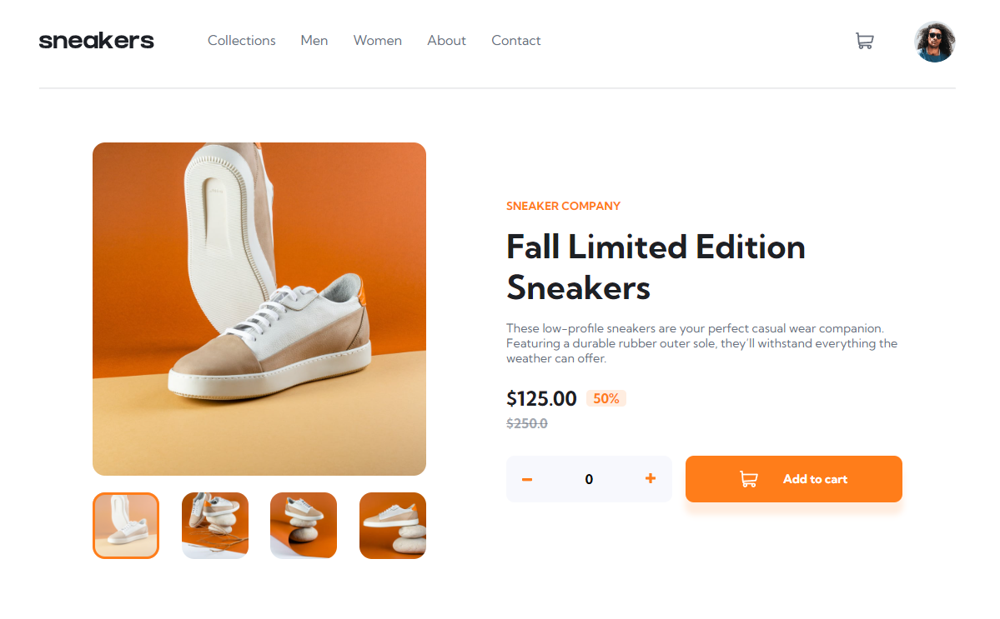

# Frontend Mentor - E-commerce product page solution

This is a solution to the [E-commerce product page challenge on Frontend Mentor](https://www.frontendmentor.io/challenges/ecommerce-product-page-UPsZ9MJp6). Frontend Mentor challenges help you improve your coding skills by building realistic projects.

## Table of contents

- [Overview](#overview)
  - [Screenshot](#screenshot)
- [My process](#my-process)
  - [Built with](#built-with)
- [Author](#author)

## Overview

### Screenshot

### Links

- Solution URL: https://github.com/gzeta24/ecommerce-product-page-main
- Live site:

## My process

### Built with

- Semantic HTML5 markup
- CSS custom properties
- JavaScript

## Author

- Giuliano Suarez
- Frontend Mentor - [@gzeta24](https://www.frontendmentor.io/profile/gzeta24)
